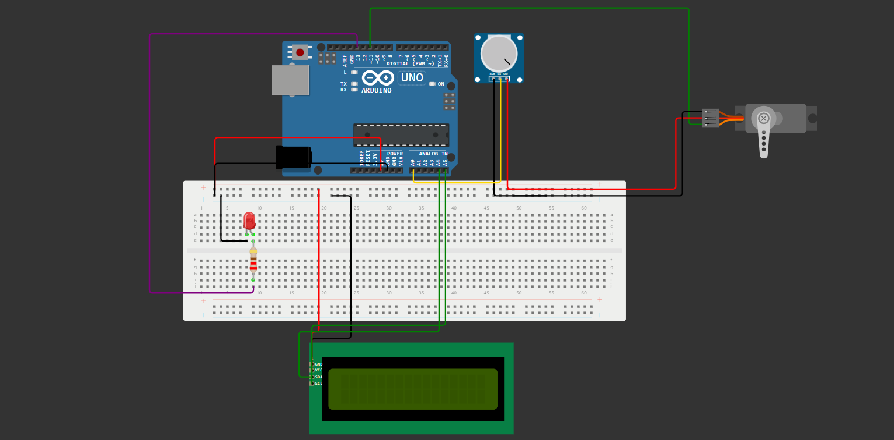

# Clean Ocean 🌊

## 📝 Descrição
O Clean Ocean tem o intuito de preservar os ecossistemas marinhos e fomentar a sustentabilidade 
dos oceanos por meio de um sistema avançado de detecção e contenção de vazamentos de combustíveis e óleos.

A solução é baseada em um dispositivo que detecta vazamentos de petróleo ou óleos que são prejudiciais aos mares e oceanos
indentificando-os em etágios iniciais e implementando medidas ágeis de contenção.

## 🛠️ Materiais Necessários

| Quantidade| Componente | 
|---------- |----------|
| 1         | Arduino Uno R3   |
| 1         | LCD I2C 16x2        |
|1          | Potenciometro   |
| 1         | Servo Motor     |
|1     | Resistor de 220 Ohm|
|1     | LED Vermelho |
|   15   |Fios (Jumpers)|
|1     |Protoboard|

## 📌 Funcionamento do Projeto

Para detectar os vazamentos utilizamos um potenciometro, simulando-o, e quando detectado são acionados um servo
motor para rápida contenção e um led vermelho indicando visualemnte.

Todo o status do compartimento é exibido em tempo real em uma tela de LCD, para melhor experiência do usuário e tomada de decisões.

## 🧩 Como Montar o Circuito?

- Conecte o Sensor de Nível de Líquido ao Arduino:

  - Conecte o sensor de nível de líquido (Potenciometro) ao Arduino, garantindo que o pino de sinal esteja conectado ao pino analógico do Arduino (por exemplo, A0), o pino de alimentação (VCC) ao 5V do Arduino e o pino de terra (GND) ao GND do Arduino.

- Conecte o LED ao Arduino:

  - Conecte o LED à protoboard, conectando o terminal positivo (ânodo) do LED a um resistor e, em seguida, ao pino digital do Arduino (por exemplo, 13).
  - Conecte o terminal negativo (cátodo) do LED ao GND do Arduino.

- Conecte o Servo Motor ao Arduino:

  - Conecte o servo motor ao Arduino, conectando o fio de sinal do servo ao pino digital do Arduino (por exemplo, 11), o fio de alimentação do servo ao 5V do Arduino e o fio de terra do servo ao GND do Arduino.

- Faça as Conexões Elétricas:

  - Utilize os fios de conexão para interligar os componentes de acordo com o esquema do circuito fornecido para o projeto de detecção e contenção de vazamentos marítimos.

- Monte o Circuito na Protoboard:

  - Monte o circuito na protoboard seguindo o esquemático fornecido, garantindo que todas as conexões estejam firmes e corretas.

  - Utilize a Imagem do Circuito:
       

        
Imagem do circuito:

        
  

## 💻 Como Instalar e Executar o Código

### Opção 1: Instalação da IDE do Arduino (Para quem possui o Arduino fisicamente)
- Baixe e instale a IDE do Arduino em seu computador.
- Abra a IDE do Arduino.
- Crie um novo projeto na IDE do Arduino.
- Copie o [código fornecido](codigo_fonte.cpp) para o projeto e cole na janela do editor da IDE.
- Conecte o Arduino ao seu computador usando um cabo USB.
- Selecione o tipo de placa Arduino e a porta serial correta na IDE do Arduino.
- Compile o código clicando em "Verificar" (ícone de visto) na barra de ferramentas da IDE.
- Faça o upload do código para o Arduino clicando em "Carregar" (ícone de seta para a direita) na barra de ferramentas da IDE.
- Após o upload, o sistema estará pronto para ser executado e você poderá verificar as leituras dos sensores e a ação do servo motor e do LED.

### Opção 2: Utilização do WOKWI (Para quem deseja simular o projeto online)
- Acesse o  [WOKWI](https://wokwi.com/) e inicie um novo projeto de circuito.
- Adicione os componentes necessários ao projeto, incluindo Arduino Uno, Potenciometro, servo motor e LED.
- Conecte os componentes de acordo com o esquemático fornecido no projeto.
- Cole o [código fornecido](codigo_fonte.cpp) para o projeto na área de edição do código do Arduino.
- Inicie a simulação clicando no botão "Start Simulation" na barra de ferramentas do Tinkercad.
- Após a simulação, você poderá observar o comportamento do sistema e verificar as leituras dos sensores e a ação do servo motor e do LED.

## 🖋️ Autores

- [Giulia Barbizan](https://github.com/Giulia-Rocha) RM: **558084**
- [Gustavo Viega](https://github.com/Vieg4) RM: **555885**
- [Felipe Marques](https://github.com/FelipeMarquesdeOliveira) RM: **556319**

## Links Úteis

- [Simulação Wokwi](https://wokwi.com/projects/399770863841218561)
- [Vídeo Explicativo]()
